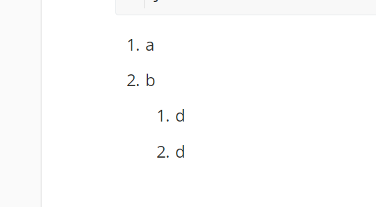

# Java基础

## 二级


### 三级


#### 四级


##### 五级


###### 六级


- liu
  - liu
    - liu


> baoga 
>
> > afadfads

```java
public static class A{
    
}
```

1. a
2. b
   1. d
   2. d




ok


==fafdasfsaf==

<mark>mark</mark>

**加粗**


~~发发发~~

[百度](www.baidu.com)


~dfd~asfas^daga^

<sub>下</sub>中<sup>上</sup>

<!---->

`code`


!> nihao

?> nihao


[toc]


------


- [ ] no

- [x] yes