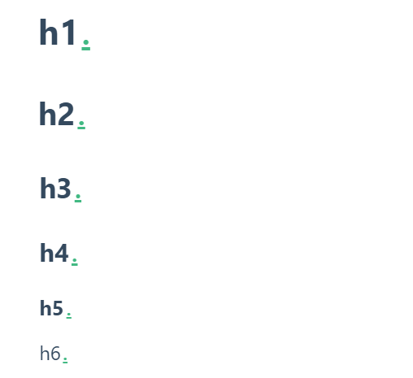

# markdown语法-docsify篇

在`docsify`博客搭建成功之后，你是否迫不及待的想要写下一篇完整的笔记，但是又不了解`markdown`的语法呢，不必担心，看完这个教程，包你学会\~~~

推荐编辑器：[typora](https://www.typora.io/)

图片的存储建议使用图床，便于博客文章的迁移

## 语法说明

### 1、标题

标题有六个级别 `h1-h6`

h1 的字体最大使用 `# 标题名`表示

h1=>h6随着`#`个数增加，字体大小逐渐变小 

```markdown
# h1
## h2
### h3
#### h4
##### h5
###### h6

------------------------------------------------------
如果你想要给你的标题添加`id`或者`class`，就在标题最后添加{#id .class1 .class2}。如：
# 标题 {#id .class}

/*这是一个MPE扩展的特性*/
```

**演示效果**



### 2、强调

增加文字着重效果

```markdown
  *斜体*
  _斜体_

  **粗体**
  __粗体__

  _组**组合**合_
  *组__组合__合*
  **组_组合_合**
  __组*组合*合__

  ~~删除~~
  ==标记==
```

!> ==标记== 在`docsify`中不会生效，可使用**mark**标签代替，如：`<mark>标记</mark>`

**演示效果**

  *斜体*
  _斜体_

  **粗体**
  __粗体__

  _组**组合**合_
  *组__组合__合*
  **组_组合_合**
  __组*组合*合__

  ~~删除~~
  ==标记==


### 3、列表

#### 无序列表

常用`- 列表名`或`* 列表名`或`* 列表名`表示

```markdown
* 列表1
- 列表2
    - 列表2.1
        - 列表2.1.1
        	- 列表2.1.1.1
    + 列表2.2
```

**演示效果**

* d列表1

- 列表2
    - 列表2.1
        - 列表2.1.1
        	- 列表2.1.1.1
    - 列表2.2


#### 有序列表

```markdown
  1. 列表1
  1. 列表2
      1. 列表2.1
          1. 列表2.1.1
              1. 列表2.1.1.1
      1. 列表2.2
```

**演示效果**

  1. 列表1
  1. 列表2
      1. 列表2.1
          1. 列表2.1.1
              1. 列表2.1.1.1
      2. 列表2.2


#### 任务列表

```markdown
- [x] 任务失败
- [ ] 任务成功
```

**演示效果**

- [x] 任务失败
- [ ] 任务成功


### 4、图片

可使用``或者 `img`标签表示，但是`markdown`语法图片样式效果不是太好，如果想对图片样式进行操作推荐使用`img`标签

```markdown


#改大小 以下只是方案 不是所有编辑器的都支持
{:width:30% hight:30%}


 #在md文件中HTML代码直接转为HTML实体
```

**演示效果**


```markdown

```


 

```html

```


### 5、超链接

```markdown
[显示文字](网页url)

[github](https://github.com)
```

**演示效果**

[点击试试](http://www.baidu.com "跳到百度")


### 6、引用

```markdown
> 引用的内容
> > 嵌套
```

**演示效果**

> 引用的内容
>
> > 嵌套


### 7、分隔符


```markdown
连字符：
--- 

星号：
***

下划线：
___
```

**演示效果**

连字符：

---

星号：
***

下划线：

___


### 8、行内代码

```markdown
这个就是 `行内代码` 吗？
```

**演示效果**

这个就是 `行内代码` 吗？


### 9、代码块

~~~markdown
```
我是代码块内容
```

#语法高亮 在上吗的符号后 加上高亮显示的语言
```javascript
    var id = document.getElementById("id");
```
~~~

**演示效果**

```
我是代码块内容
```

#语法高亮 在上吗的符号后 加上高亮显示的语言
```javascript
    var id = document.getElementById("id");
```


### 10、表格

```markdown
head1 | head2
-----:|:-----:
cell1 | cell2
cell3 | cell4
#可以HTML的table标签替换

对齐方式
:-----: 居中
:-----    居左 默认
 -----:    居右

复杂表格
<table>
	<th>
		<td colspan="2">列合并colspan</td>
	</th>
	<tr>
		<td>cell1</td>
		<td rowspan="2">行合并rowspan</td>
		<td>cell2</td>
	</tr>
	<tr>
		<td>cell3</td>
		<td>cell4</td>
	</tr>
</table>
```

**演示效果**

简单表格

| head1 | head2 |
| ----: | :---: |
| cell1 | cell2 |
| cell3 | cell4 |

复杂表格

<table>
	<th>
		<td colspan="3">列合并colspan</td>
	</th>
	<tr>
		<td>cell1</td>
		<td rowspan="2">行合并rowspan</td>
		<td>cell2</td>
	</tr>
	<tr>
		<td>cell3</td>
		<td>cell4</td>
	</tr>
</table>


### 11、Emoji

颜文字大全：https://www.webfx.com/tools/emoji-cheat-sheet/

```markdown
:smile:
```

**演示效果**

:smile:

​

12、...


### docsify特有

```markdown
!> 警告
```

!> 警告

```
?> 提示
```

?> 提示


